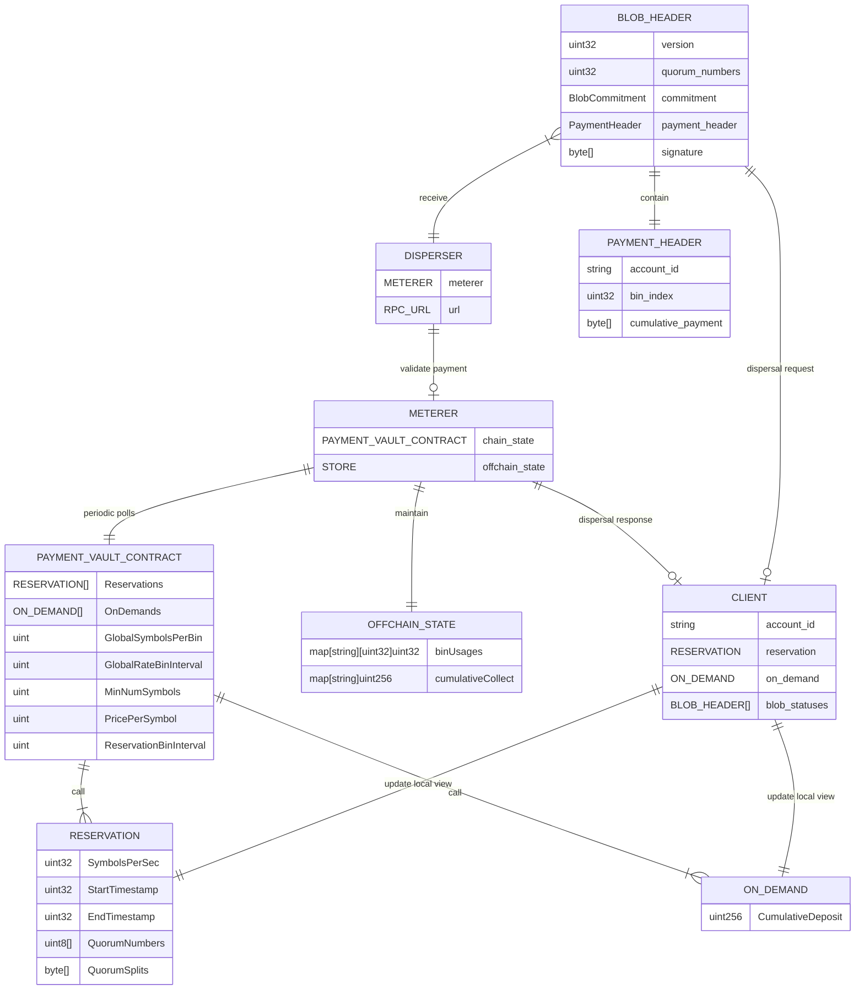
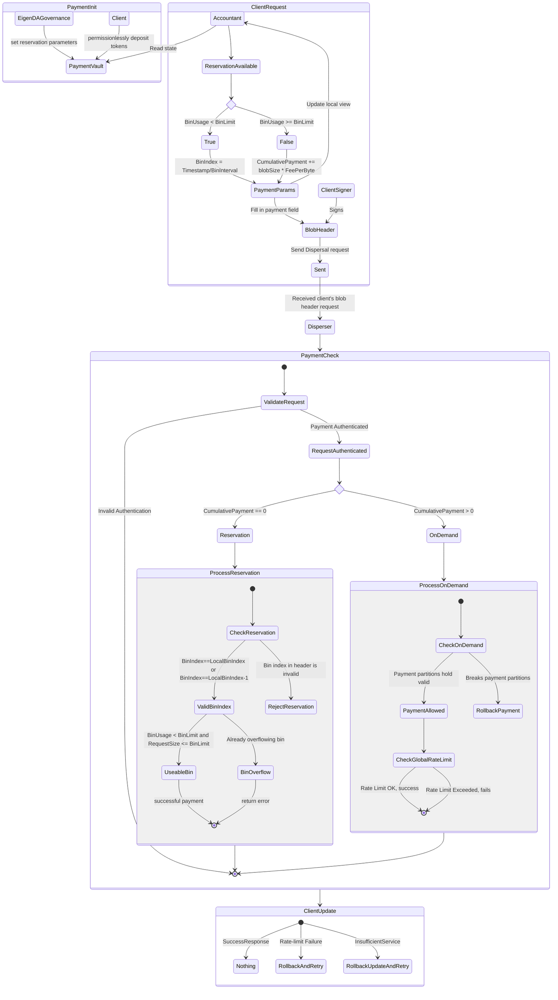

# Centralized Payments Documentation

This documentation provides an overview of the Centralized Payments MVP for EigenDA. It describes key components, use cases, design principles, and the system architecture to implement centralized payments using a disperser-based solution. The aim is to facilitate reservation and on-demand payments for data dispersal, ensuring scalability and flexibility for users and operators. The document will also provide a high level roadmap for decentralizing the payments system.

EigenDA's centralized payments are designed to allow users to pre-pay for services, with two primary payment methods:
- **Reservation Payments**: Pre-paid throughput guaranteed services for a fixed time period.
- **On-Demand Payments**: Pre-paid services without throughput guarantees, allowing flexibility with data dispersal based on network conditions.

The system leverages a centralized disperser to handle accounting, metering, and validation of incoming payment requests. This initial approach assumes a trust model where participants trust the disperser for accurate metering and accounting.

### Design Principle
- Minimize locking mechanisms using optimistic concurrency control, allowing high-throughput concurrency.
- Assume no conflicts by default, with rollback mechanisms for data inconsistencies when required.

## Functionalities and Use Cases
### Supported Use Cases
1. **Reservation Payments**: Users can sign up for reserved bandwidth by pre-paying tokens. These reservations are defined by a fixed time period, rate limits, and other parameters negotiated between users and the EigenDA team.
2. **On-Demand Payments**: Users can deposit tokens to receive services on a pay-as-you-go basis without guaranteed bandwidth. This payment mode is deducted only upon successful data dispersal.
3. **Client Utility Functions**: Functions that allow users to determine their preferences for either reservation or on-demand services, enabling flexible service use.
4. **DA Node Operators**: DA node operators are not directly involved in the payments, which simplifies their operation and responsibilities.
5. **Statistics and APIs**: Disperser exposes statistics on pricing and reservation schedules to authenticated users.

### System Actors
- **Disperser Client**: Submits data for dispersal and manages payments via reservation or on-demand deposits.
- **Disperser**: The central entity responsible for processing payments, dispersing data, and managing reservations.
- **Payment Contract**: On-chain smart contract for managing reservations and on-demand payments.
- **DA Node Operator**: Provides data availability services and interacts indirectly with payment mechanisms.

## System Architecture
### High-Level Overview
The centralized payments system revolves around the following key entities:
- **Disperser**: The primary entity responsible for handling payments, metering, and data dispersal.
- **Client Request**: Users initiate requests to either create reservations or make on-demand payments. The disperser processes these requests according to predefined rules and parameters.
- **Meterer**: Handles accounting and tracks the usage of reserved or on-demand payments.
- **On-Chain and Off-Chain State**: A combination of on-chain smart contracts for reservations and persistent off-chain storage for on-demand state management.

Disperser client send a dispersal request containing payment header to the disperser, which will be verified by the disperser's meterer. If the payment is valid, the disperser will disperse the data and update the offchain payment state. The meterer maintains the payment state in the offchain state, and syncs to the payment contract onchain periodically. Currently, the meterer only reads from the on-chain payment contract, and does not make any state changes to the payment contract. Clients can query the disperser for their own offchain state for payment and usage information.

Client can query the disperser for their own offchain payment state, which includes the cumulative payment and the bin usages. Clients' accountant will priortize using reservations before using on-demand payments.

 A client has their specific reservation parameters set on-chain, including timestamp validity, and bin limit; all reservations adhere to the same reservation bin interval. The disperser will track at least 4 bins per reservation, starting from the previous bin to the bin after next bin. The previous bin is used in case of request latency, and the bin after next bin is used to allow for reasonable overflows. 
 
 If a client's reservation bin is full, the client can either wait for the next reservation period, or switch to on-demand payments. Our implementation of disperser client will automatically switch to on-demand payments when the reservation bin is full. The cumulative payment is incremented by the number of symbols in the blob times the price per symbol. Disperser will check the dispersal requests' cumulative payment against the local payment state, such that the partition of deposted tokens holds with respect to symbols per requests even if the requests arrived out of order. If the cumulative payment exceeds the client's on-chain deposit, cannot fit with the existing payment partitions, or hits the global rate limit, the request will be rejected.

## Security Analysis
### Assumptions
- The disperser acts honestly in metering requests and dispersing blobs.

### Threats and Mitigations
- **Insufficient Payment Validation**: If a request does not meet the payment requirements, the disperser will reject the request to prevent unauthorized data dispersal.
- **Global Rate Limits**: Enforced to ensure that no single user can monopolize network resources, ensuring fair use among all participants.
- **Optimistic Concurrency**: Payment updates and rate checks are performed optimistically to minimize locking and prevent bottlenecks.

## Future Enhancements

### High-Level Roadmap to Decentralization

- **Decentralized Disperser**: The first step towards decentralization involves replacing the centralized disperser with a distributed network of dispersers. This approach will help eliminate single points of failure and improve the system's resilience. Each disperser node will be responsible for metering, payment validation, and data dispersal in a decentralized manner.
- **Global Rate Limiting**: Implement a decentralized global rate limiting mechanism. Instead of relying on a single disperser to enforce rate limits, a distributed consensus mechanism can be used to ensure fair bandwidth allocation across the network. 
- **Payment State Tracking**: Transition payment state tracking to a decentralized model. This will involve using distributed ledger systems to record payment transactions, ensuring that all payment actions are transparent and verifiable. Smart contracts can be employed to handle payment verification and updates.
- **Client-Side Payment Management**: Empower clients to manage their own payment states in a decentralized manner. Clients should be able to interact directly with smart contracts for both reservation and on-demand payments and independently verify their payment status and usage metrics.

