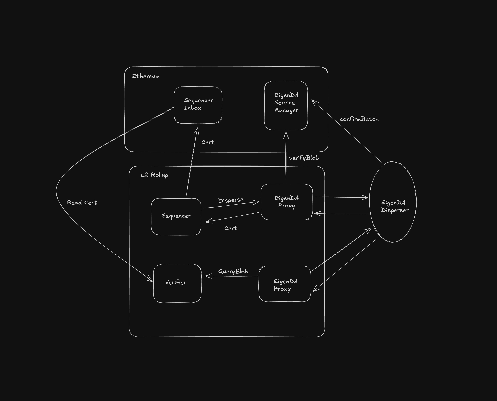

# EigenDA Proxy

## About
EigenDA proxy is a sidecar REST server meant to be run next to a rollup node for communicating with the EigenDA network.

### Example Rollup interaction diagram
*Shown below is a high level flow of how proxy is used across a rollup stack by different network roles
(i.e, sequencer, verifier). Any rollup node using an eigenda integration who wishes to sync directly from the parent
chain inbox or a safe head must run this service to do so.*

### Usage
Different actors in the rollup topology will have to use proxy for communicating with EigenDA in the following ways:
- **Rollup Sequencer:** posts batches to proxy and submits accredited DA certificates to batch inbox
- **Rollup Verifier Nodes:** read batches from proxy to update a local state view (*assuming syncing from parent chain
directly)*
- **Prover Nodes:** both rollup types (i.e, optimistic, zero knowledge) will have some way of deriving child chain
state from the parent's inbox for the purpose of generating child --> parent bridge withdraw proofs. These "proving
pipelines" will also read from proxy as well; either for settling disputes in optimistic rollups with working fraud
proofs or for generating zero knowledge proofs attesting to the validity of some batch execution. 

*E.g, In Arbitrum there is a `MakeNode` validator that posts state claims to the parent chain's rollup assertion chain.
In the event of a challenge, both asserter/challenger players will have to pre-populate their local pre-image stores
with batches read from the proxy to compute the WAVM execution traces that they will bisect over.*

## Technical Details
[EigenDA Proxy](https://github.com/Layr-Labs/eigenda-proxy) wraps the high-level EigenDA clients with an HTTP server,
and performs additional verification tasks when reading and writing blobs that eliminate any trust assumption on the
EigenDA disperser service. EigenDA Proxy also provides additional security features (i.e, read fallback) and optional
performance optimizations (i.e, caching). Instructions for building and running the service can be found
[here](https://github.com/Layr-Labs/eigenda-proxy/blob/main/README.md).

## Additional Links

- [EigenDA V1 Proxy details](./v1/dispersal/clients/eigenda-proxy-v1.md)
