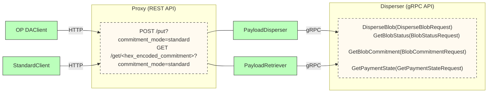

The EigenDA disperser presents a grpc API with 4 rpc methods for both v1 and v2. See the protobuf definitions for [v1](https://github.com/Layr-Labs/eigenda/blob/master/api/proto/disperser/disperser.proto) and [v2](https://github.com/Layr-Labs/eigenda/blob/master/api/proto/disperser/v2/disperser_v2.proto) for full details. This API is asynchronous and requires managing payment state and polling for blob status, until a cert is available. Furthermore, a payload must be encoded into an EigenDA blob before it can be dispersed (see the [V2 integration spec](https://layr-labs.github.io/eigenda/integration.html) for full details). We provide [golang](https://github.com/Layr-Labs/eigenda/tree/master/api/clients) and [rust](https://github.com/Layr-Labs/eigenda-client-rs) clients to simplify the integration process.

The [EigenDA Proxy](./eigenda-proxy/eigenda-proxy.md) is a proxy server that can be spun up to provide a simple REST API to simplify interacting with the EigenDA Disperser. It handles the payment state, blob status polling, and cert verification for you, and provides a simple interface for dispersing and retrieving blobs. We recommend most users make use of the proxy, as it simplifies the integration process significantly.

The below diagram documents the different ways to interface with the EigenDA disperser.

Advanced usecases might require using the clients directly. For example, ZKsync prefered to keep their [ZK Stack](./rollup-guides/zksync/README.md) sequencer as a single binary and thus didn't want to have to spin up a sidecar process. So they opted to integrate with our rust client directly in their DA dispatcher code. For most users however, we recommend making use of the EigenDA proxy. This is how [Arbitrum Nitro](./rollup-guides/orbit/overview.md) and [Op Stack](./rollup-guides/op-stack/README.md) integrations work.