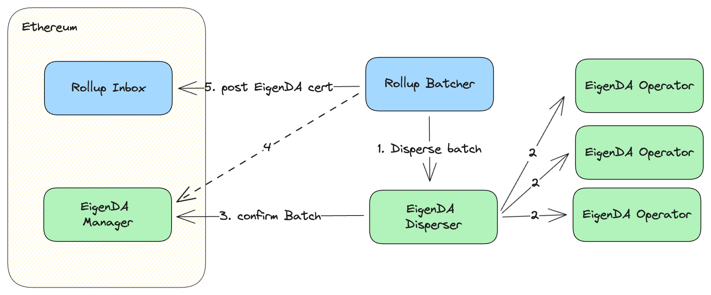
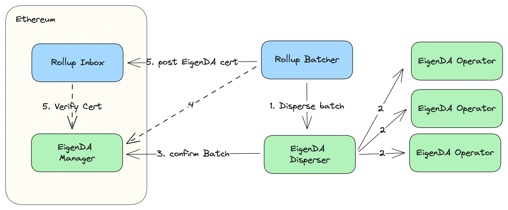
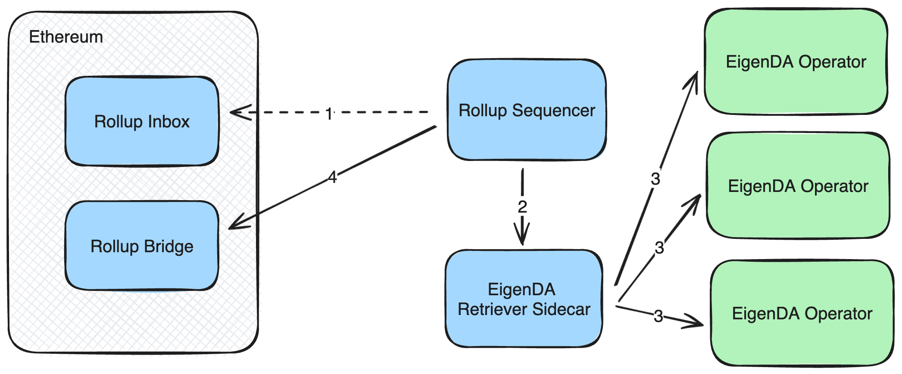
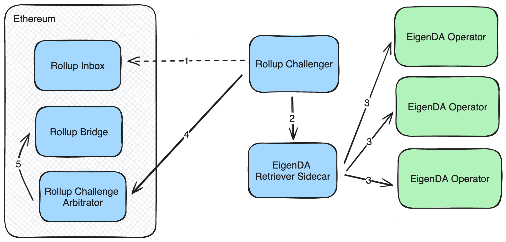

# Secure Integration Overview

This document aims to outline what a secure EigenDA integration looks like, to provide rollup
engineers with a strong understanding of how an EigenDA integration would impact
their tech stack and security model. For full details, see the [EigenDA V2 integration spec](https://layr-labs.github.io/eigenda/integration/spec/6-secure-integration.html#certblobtiming-validation).

> Note: Each rollup stack uses slightly different terminology to refer to the same ideas.
> We try to use the most general language possible but might sometimes use stack-specific language for clarity.

For any given rollup there are five main concerns inherent to an integration
with external DA:

1. **Dispersal.** The rollup batcher must write transaction batches to the DA
    layer, wait for confirmation, and write the resulting DA certificate to the
    [rollup inbox][glossary-rollup-inbox].
2. **Certificate Verification.** Either the rollup inbox contract
    or the rollup OS must verify that DA certificate is valid, i.e. that enough
    operators have certified the blob available, before reading the DA cert's data
    from the DA layer. This ensures that a transaction batch referenced by an
    invalid certificate is not executed.
   1. **Certificate Punctuality (Timing) Verification.** The certificate must be posted to the batcher inbox within some punctuality window.
    EigenDA blobs are only available to download for 2 weeks, so this check is necessary to prevent malicious sequencers from posting certificates right before the blob gets deleted.
3. **Retrieval.** Rollup full nodes must retrieve EigenDA blobs as part of the
    L2 derivation/challenge process. Otherwise they cannot keep up with the state of
    the L2.
4. **Blob Commitment Verification.** The rollup's fraud arbitration protocol must be
    capable of verifying that every EigenDA blob used to generate a state root
    matches the KZG commitment provided in the EigenDA cert posted to the rollup
    inbox. In doing this verification, the chain ensures that the transaction data
    used to generate the rollup's state root was not manipulated by the
    sequencer/proposer.

A fully secure integration requires doing the 3 verification checks.

|               | Dispersal | Retrieval | Cert Verification | Blob Verification | Timing Verification |
| ------------- | --------- | --------- | ----------------- | ----------------- | ------------------- |
| Trusted       | x         | x         |                   |                   |                     |
| Fully Secured | x         | x         | x                 | x                 | x                   |

There are different strategies for implementing each of these checks, with different rollup stacks employing
different strategies. We outline the different approaches in this document.

## Trusted Integration (Dispersal+Retrieval) {#trusted-integration}

The trusted integration trusts that the sequencer is verifying certs and 
posting them to the rollup inbox in a timely fashion. 
This integration focuses on dispersal and retrieval for the sake of simplicity, 
but at the cost of security. Let's walk through the lifecycle of an L2 batch:

1. The batcher component of the rollup sequencer prepares an L2 batch, and calls
    the **DisperseBlob()** rpc on the EigenDA disperser, sending the batch data.
2. The disperser erasure-encodes the blob into chunks, calculates the KZG
    commitment, and calculates the KZG proof for each chunk. It then distributes the
    chunks to the EigenDA operator set, where each operator receives a subset of
    the chunks in proportion to its stake. Each operator then stores the chunks its
    received, verifying that each chunk matches its KZG proof and KZG commitment.
    If so, it signs a message certifying that the chunk has been stored and returns
    it to the disperser.
3. The disperser aggregates the signatures from step 3 into a single BLS
    signature and sends it and some blob metadata to to the EigenDA Manager contract on
    Ethereum. The EigenDA Manager contract on Ethereum is responsible for verifying EigenDA
    certificates, and if they verify, recording that verification in storage.
    Verification consists of ensuring the aggregated signature is valid and is
    based on the current EigenDA operator set. This blob verification status is
    not used in this implementation strategy.
4. If the sequencer is using the EigenDA disperser, then it shouldn't just trust
    the disperser when it says that the blob has successfully been dispersed, it
    should verify by checking onchain. This is important in this integration
    strategy because the rollup inbox does not perform this check. Without this
    check the EigenDA disperser is trusted (in addition to the sequencer).
5. The batcher then sends a transaction to the rollup inbox contract on
    Ethereum with the EigenDA blob id as calldata, which accepts the
    EigenDA blob id.

On the derivation side, there is a similar flow in reverse. When an L2 full node
encounters an EigenDA certificate in the rollup inbox, it knows to retrieve the
underlying blob from the EigenDA operator set using the EigenDA client, and then
interpret the transactions inside.

Please keep in mind that this integration model is *insecure*. The rollup
sequencer is completely trusted in this scenario, because the fraud proof system
is disabled, and state roots cannot be challenged. This means the sequencer can
post whatever state roots they want to the bridge contract and potentially steal
funds.

## Cert Punctuality Verification

EigenDA blobs are only available to download for 2 weeks, so it is important
to ensure that the [batcher][glossary-batcher] is not posting EigenDA certs to the rollup inbox after the blob has been deleted. Each securely integrated rollup stack should have a [cert-punctuality-window][glossary-cert-punctuality-window] defined by its derivation pipeline.

## Cert Verification

Cert validity rules are encoded in the EigenDACertVerifier contract. Cert validity can thus be checked
offchain by making an eth-call, or onchain by calling the respective method. It can also be zk proven via a storage proof. See our [V2 integration spec][spec-cert-validation]. Ultimately though, the L1 chain must be
convinced that the cert is valid, which can either be done:
1. Pessimistically
   1. verify in the [rollup-inbox][glossary-rollup-inbox] contract for every blob (optimistic rollups)
   2. create a zk proof which is aggregated and submitted along with the state transition correctness proof (zk rollups)
2. Optimistically: only verify during one step proving if/when a fraud happens (optimistic rollups)

Although the pessimistic implementation is simpler, the optimistic approach is
often desirable since verification only incurs on-chain costs when the sequencer is
dishonest.

### Pessimistic Cert Verification

We only describe the inbox verification strategy here as it is mostly straightforward. There are many different ways to get a zk proof of storage, so teams wanting to use this approach should consult their relevant stack's guide.

> Note: this strategy is only possible for rollup stacks whose [rollup-inbox][glossary-rollup-inbox] is a contract (e.g. arbitrum nitro). On the op stack, the batcher inbox is an EOA so it is not possible for it to make calls to the DACertVerifier (unless [eip-7702](https://github.com/ethereum/EIPs/blob/master/EIPS/eip-7702.md) is used).

An instructive way to dive into the L2 inbox certificate verification strategy
is to follow an L2 transaction from origination to finalization on Ethereum. We
can further break this down into two stages, L2 chain finalization and L2 bridge
finalization.

**L2 Chain Finalization**

First, L2 chain finalization. An L2 transaction is finalized with respect to the
L2 chain when the transaction has been included in the [rollup-inbox][glossary-rollup-inbox] 
in a finalized L1 block. When this process is complete, any L2 node can say with confidence that the
transaction is part of the canonical L2 chain and is not subject to a reorg. For example, 
if you were selling your car and a buyer paid you by sending you
USDC on a secure rollup, it would be important to wait until the transaction had
reached L2 chain finalization before letting them drive away with your vehicle.

The above diagram is the same as the trusted integration diagram [above](#trusted-integration), with two slight modifications:

4. In order to get a fully secured integration, the batcher should wait until the confirmBatch tx
    has been finalized onchain before posting the EigenDA cert to the [rollup inbox][glossary-rollup-inbox]. This is needed
    in order to protect from an L1 chain reorg that would remove/invalidate the eigenDA cert, while leaving the batch in the inbox.
5. The rollup inbox contract is programmed not to accept the
    EigenDA certificate unless it is valid. The cert is verified by making a call to the
    `verifyDACert()` function.

At this point the user's transaction has been confirmed on the rollup. Once
the weak subjectivity window passes (2 epochs ~= 13 minutes), the user's transaction can be
considered finalized.

**L2 Bridge Finalization**

L2 bridge finalization is necessary for bridging assets or data from the L2 to
the L1. Bridge finalization depends on the rollup bridge contract on the L1
arriving on an accurate L2 state root. This is where fraud or validity proofs
come in.

Every L2 full node is responsible for deriving the L2's state root from the L1.
In the absence of fraud, this is a relatively simple process with EigenDA:

1. If an L2 full node reads an EigenDA cert from the rollup inbox, it knows this
    DA cert is valid because otherwise it would have been rejected from the inbox.
    So it uses the EigenDA client to retrieve the EigenDA blob using the EigenDA
    cert.
2. The full node executes the L2 block as described in the L2 blob against the
    current L2 state.
3. If the full node is a proposer/validator, it will post the state root of the
    L2 state to the rollup bridge contract on Ethereum every few blocks.
4. If no fraud proof has been submitted within the challenge window (~7 days),
    then the state root in the rollup bridge contract is considered valid and any
    outbound assets or messages are released by the bridge contract.

In the event of a fraud challenge, the process is more complex. There is a
second, equivalent state transition function for generating state roots which is
much slower but also a much more rigorous fraud proof.

That process models the L2 state as a virtual machine, complete with an operating
system, which continuously reads messages from the rollup inbox contract using a
special `ReadInboxMessage` opcode, and handles them accordingly. If an inbox
message describes a batch of raw L2 transactions, the L2 OS knows it should
execute them. If an inbox message describes an EigenDA cert, the L2 operating
system knows that it should pass the KZG commitment inside the cert to the
special `ReadPreImage` opcode to read the underlying data, and then handle the
messages returned.

This VM state transition function process is useful because it makes it possible
to rigorously prove that the state root was generated based on the exact data
referenced by the EigenDA cert.

Let's walk through a scenario where the proposer is dishonest, in order to
illustrate:

> Note: this section uses arbitrum nitro opcode language. OP uses [syscall](https://specs.optimism.io/fault-proof/index.html#pre-image-communication) opcodes to communicate with the preimage oracle instead.

1. The proposer encounters an EigenDA cert and rather than reading data from
    EigenDA honestly, decides to read data from elsewhere, not committed to by the
    KZG commitment in the EigenDA cert. The proposer generates a state root on the
    basis of executing these messages, and posts this state root to the rollup
    bridge contract.
2. A challenger sees that their state root for a given L2 block does not match
    the one posted by the proposer in the bridge contract, and makes a contract call
    to begin a challenge.
3. The challenger and the defender alternate narrowing the scope of their
    disagreement to a specific opcode of the VM state transition function, until
    they've narrowed their disagreement to a specific opcode. In this case, the
    challenge opts to challenge the `ReadPreImage` opcode, since this is where the
    correct EigenDA should have been read.
4. The challenger invokes the arbitration contract with the necessary VM state
    to execute the `ReadPreImage` opcode, as well as necessary extra data for
    proving that the opcode was executed correctly. This extra data includes the
    chunk of data that should have been read (only 32 bytes of data are read at a
    time) as well as a KZG proof showing that the data matches the KZG commitment
    that the opcode was invoked with. The arbitration contract checks whether the
    data matches the KZG commitment and proof.
5. If the winner of the verification is the challenger then the old state root is
    replaced with the challenger's new state root.

In order to implement an EigenDA integration with fraud proofs, the underlying
rollup must support passing KZG commitments to `ReadPreImage` opcode. The rest
of the L2 VM design works as-is for arbitrating fraud.

### Optimistic Cert Verification

The integration strategy under the V2 [Blazar](../../releases/blazar.md) release is similar to the 
existing integration strategy, with the
difference that EigenDA certificates are only verified on Ethereum if needed by the dispute game.
This requires the certs to be verified within the L2 State Transition Function (STF).
In this mode, a rollup batcher may submit invalid EigenDA certs to the rollup
inbox, because L2 nodes interpret these invalid DA certs and discard them. If
a rollup proposer submits a state root based on data referenced by an invalid EigenDA
cert, it is possible to successfully challenge that state root.

This integration strategy depends on the ability of the L2 STF to validate
EigenDA certs, which requires an authenticated view into the current EigenDA
operator set. Specifically, the L2 STF must have access to L1 state roots, so
that Eigenlayer contract storage proofs may be verified.

## Blob Commitment Verification

A rollup must check that the EigenDA blob it received from EigenDA matches the KZG commitments in the cert. For full validation rules, see the [spec][spec-blob-validation].

There are a few different strategies possible for this:
1. Recompute the KZG commitment and check it against the one in the cert. Straightforward but requires having the SRS points.
2. Have someone provide an opening proof for the KZG commitment. See this [issue](https://github.com/Layr-Labs/eigenda/issues/1037) for full details.
3. For some zk rollups, the commitment posted onchain is of a different kind, and thus requires [proving equivalence](https://notes.ethereum.org/@dankrad/kzg_commitments_in_proofs#The-trick).

<!-- Link References -->
[glossary-rollup-inbox]: ./glossary.md#rollup-inbox
[glossary-batcher]: ./glossary.md#rollup-batcher
[glossary-cert-punctuality-window]: ./glossary.md#cert-punctuality-window

[spec-cert-validation]: https://layr-labs.github.io/eigenda/integration.html#cert-validation
[spec-blob-validation]: https://layr-labs.github.io/eigenda/integration.html#blob-validation
