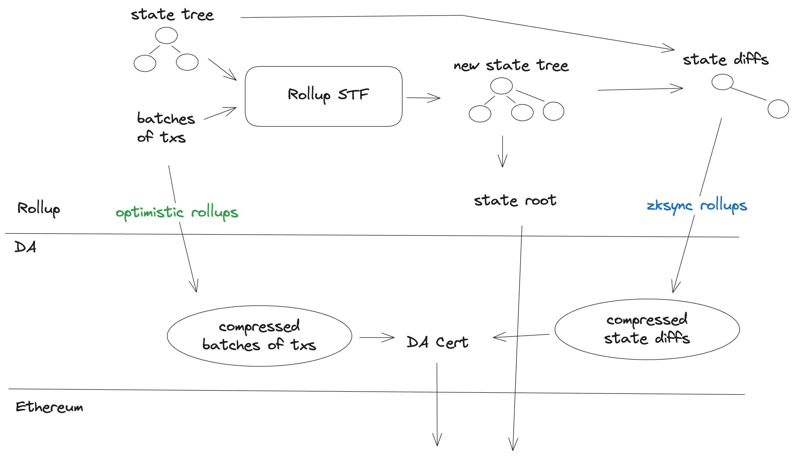
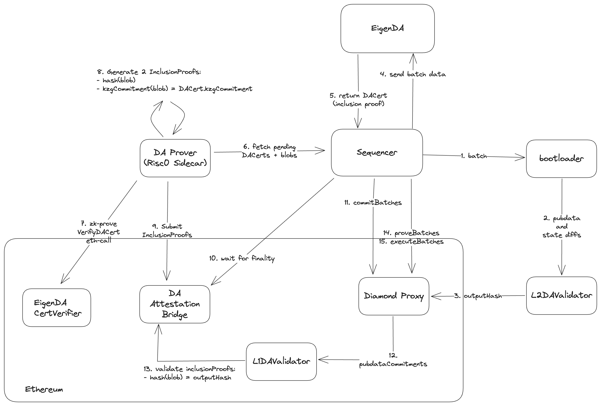

# ZKsync and EigenDA

We have implemented an [EigenDA Client](https://github.com/matter-labs/zksync-era/tree/main/core/node/da_clients/src/eigen) following ZKsync's [validium architecture](https://docs.zksync.io/zk-stack/running/validium). Our integration is currently in [stage 1](#stage-1) and we are working towards [stage 2](#stage-2).

## Overview

Unlike most other rollup stacks, ZKsync posts compressed state diffs to EigenDA, as opposed to batches of transactions. For more information as to the motivation for this, as well as technical details, see ZKsync's [Data Availability](https://docs.zksync.io/zksync-protocol/rollup/data-availability) documentation.

<!-- Image source: https://app.excalidraw.com/s/1XPZRMVbRNH/1fYTKbI9b4H -->


Overall, the [transaction lifecycle](https://docs.zksync.io/zksync-protocol/rollup/transaction-lifecycle) remains unaffected, other than the data (compressed state diffs) being submitted to EigenDA, and a DACert submitted to L1.

### Stage 1
> a Validium that only sends the data to the DA layer, but doesn’t verify its inclusion

ZKsync prefers to have their sequencer run as a single binary without sidecars. Therefore, our ZKsync integration does not use the [EigenDA Proxy](../../dispersal/clients/eigenda-proxy.md). Rather, we use our rust [eigenda-client](https://github.com/Layr-Labs/eigenda-client-rs). And the [EigenDA Client](https://github.com/matter-labs/zksync-era/tree/f05fffda72393fd86c752e88b7192cc8e0c30b68/core/node/da_clients/src/eigen) wrapper inside the ZKSync-Era repo implements the 2 [required trait](https://docs.zksync.io/zk-stack/running/validium#server-related-details) methods `dispatch_blob` and `get_inclusion_data`.

### Stage 2
> a Validium that sends the data to the DA layer, and also verifies its inclusion on L1 either by using the verification bridges or zk-proofs directly.

In the stage 2 model, in order for ZKsync's prover to remain AltDA agnostic, their Validium architecture mandates that a sidecar prover is used to prove the inclusion of the compressed state diffs on EigenDA, to the L1. We use Risc0 for this sidecar prover.

<!-- Image source: https://app.excalidraw.com/s/1XPZRMVbRNH/9envZ9u54Sl -->


## Deployment

### Local Deployment

Follow the steps in the Validium [FAQ](https://docs.zksync.io/zk-stack/running/validium#faq):
1. Install `zkstack` following [this guide](https://github.com/matter-labs/zksync-era/tree/main/zkstack_cli)
2. `zkstack dev clean all` - to make sure you have an empty setup
3. `zkstack containers` - this creates the necessary docker containers
4. `zkstack ecosystem init` - init a default ecosystem (go with default options everywhere)
5. `zkstack chain create` - create a new chain, stick to the default options, but select Validium when prompted, use this chain as default (the last question there)
6. `zkstack chain init` - init the new chain
7. configure the client, see [section below](#client-configuration)
8. `zkstack server --chain YOUR_CHAIN_NAME` - run the server

### Production Deployment

The production deployment should be similar to the local deployment. It will require setting up the [eigenda client](#client-configuration). See ZKsync's [production deployment](https://docs.zksync.io/zk-stack/running/production) docs for more information.

### Client configuration

> Note: The docs below might be outdated. Please refer to the ZKSync Era [EigenDA Client](https://github.com/matter-labs/zksync-era/tree/main/core/node/da_clients/src/eigen) and its [Config](https://github.com/matter-labs/zksync-era/blob/main/core/lib/config/src/configs/da_client/eigen.rs) as the source of truth.

First you need to set the `use_dummy_inclusion_data` field in the file `etc/env/file_based/general.yaml` to `true`. This is a pending solution until our Stage 2 integration is complete.

```yaml
da_dispatcher:
  use_dummy_inclusion_data: true
```

The client can be set up by modifying the field `da_client` of the file `etc/env/file_based/overrides/validium.yaml`.
These are the fields that can be modified:

- `disperser_rpc` (string): URL of the EigenDA Disperser RPC server.
- `settlement_layer_confirmation_depth` (unsigned number): Block height needed to reach in order to consider the blob
  finalized. A value less or equal to 0 means that the disperser will not wait for finalization.
- `eigenda_eth_rpc` (optional string): URL of the Ethereum RPC server. If the value is not set, the client will use the
  same rpc as the rest of the zk server.
- `eigenda_svc_manager_address` (string): Address of the service manager contract.
- `wait_for_finalization` (boolean): Wait for the blob to be finalized before returning the response.
- `authenticated` (boolean): Authenticated dispersal. If true, the client will use the authentication mechanism, using a
  whitelisted account. Using non authenticated dispersal is not recommended, as to many requests to the EigenDA
  disperser leeds to timeouts. (the following two fields are mutually exclusive)
- `points_source_path` (string): Path to the local points source files.
- `points_source_url` (string): URLs of the points source files.
- `custom_quorum_numbers` (optional list of numbers): quorums to be used beside the default ones.

So, for example, a client setup that uses the holesky EigenDA client would look like this:

```yaml
eigen:
  disperser_rpc: https://disperser-holesky.eigenda.xyz:443
  settlement_layer_confirmation_depth: 0
  eigenda_eth_rpc: https://ethereum-holesky-rpc.publicnode.com
  eigenda_svc_manager_address: 0xD4A7E1Bd8015057293f0D0A557088c286942e84b
  wait_for_finalization: false
  authenticated: false
  points_source_url:
    g1_url: https://github.com/Layr-Labs/eigenda-proxy/raw/2fd70b99ef5bf137d7bbca3461cf9e1f2c899451/resources/g1.point
    g2_url: https://github.com/Layr-Labs/eigenda-proxy/raw/2fd70b99ef5bf137d7bbca3461cf9e1f2c899451/resources/g2.point.powerOf2
  # custom_quorum_numbers: 2,3 # uncomment to use other quorums besides defaults
```

If using `authenticated` dispersal, you also need to modify `etc/env/file_based/secrets.yaml` to include the private key
of the account that will be used. You need to add the following field:

```yaml
da:
  eigen:
    private_key: <PRIVATE_KEY>
```

Note: the private key should be in hex format, without the `0x` prefix.