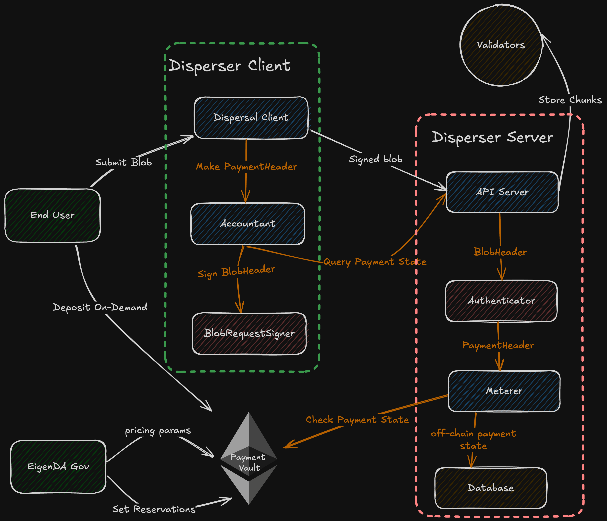
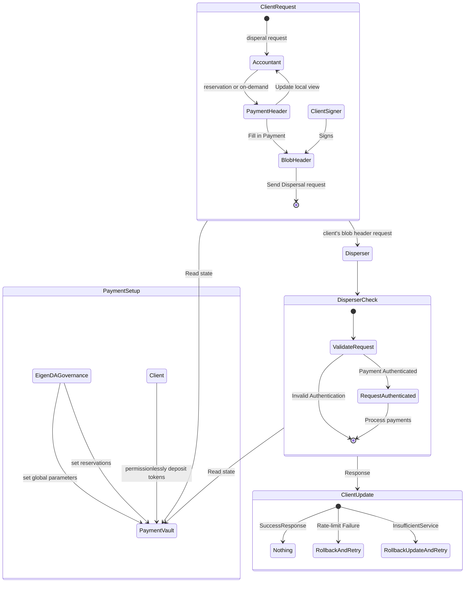

# Payments

The Payments system streamlines user interactions with the EigenDA, offering clear, flexible options for managing network bandwidth. With the payments update, EigenDA will support two flexible payment modalities:

1. **On-demand Usage**: Users can make pre-paid payments for occasional usage without time limitations or throughput guarantees, and payments are recored per blob dispersal request. Charges are applied only when the request is successfully validated by the disperser server, providing flexibility for users with dynamic bandwidth requirements. 

2. **Reserved Usage**: Users can reserve bandwidth for a fixed time period by pre-paying for system capacity, ensuring consistent and reliable throughput at discounted prices.

The system supports transparent pricing and metering through a centralized disperser, which handles both accounting and metering. The current design assumes trust in the disperser to allow efficient allocation and distribution of bandwidth.

## Design Goals

The overall goal of the payments upgrade is to introduce flexible payment modalities to EigenDA in a manner that can be gracefully extended in order to support permissionless dispersal to the EigenDA validator network.

### On-Demand Usage

On-demand usage allow users to make occasional, pre-paid payments and get charged per blob request, without specific time limitations or throughput guarantees. This approach is ideal for users with unpredictable bandwidth needs. Through the `PaymentVault` contract, users can deposit funds via the `depositOnDemand` function. Charges are only applied once the dispersal request is successfully processed, offering a flexible and efficient solution for dynamic usage patterns.

Users can retrieve their current on-demand balance from the disperser, enabling users to monitor their available funds effectively and plan for future bandwidth usage.

### Reserved Usage

Reserved usage provide customers with consistent bandwidth over a defined period. The EigenDA `PaymentVault` contract maintains a record of existing reservations, with each reservation specifying the bandwidth allowance, period of applicability, etc.

Once a reservation is created onchain, it can be updated through the `setReservation` function in the contract. This function is called by EigenDA governance to manage and maintain reservations for users.

During a reservation's period of applicability, a user client can send a dispersal request authenticated by an account associated with one of these reservations. Such requests are subject to a simple fixed-bin rate limiting algorithm, which helps manage the network load effectively. The fixed-bin algorithm divides time into discrete periods (called `reservationPeriod`) and assigns a usage limit to each period. During each period, requests are accepted until the period's capacity is exhausted. This approach ensures that the network is not overloaded during any specific period.

## High-level Design

The payment system consists of the following components: 

- **Users**: Permissionlessly deposit tokens for on-demand payments and/or negotiate reservations with the EigenDA team
- **EigenDA Client**: Users run a client instance to submit data for dispersal and manage payments. (This client is integrated into the EigenDA proxy)
- **Disperser Server**: The central entity responsible for processing payments and dispersing data.
- **Payment Vault**: Onchain smart contract for on-demand payments and managing reservations.
- **EigenDA Governance**: The EigenDA governance wallet manages the payment vault global parameters and reservations.




To initiate a dispersal, the EigenDA client sends a dispersal request containing a payment header to the disperser, which will be verified by the disperser's meterer. If the payment is valid, the disperser will disperse the data and update the offchain payment state. The meterer maintains the payment state in the offchain state, and syncs to the payment contract onchain periodically. Currently, the meterer only reads from the on-chain payment contract, and does not make any state changes to the payment contract; once the meterer has validated the payment, the metering will not rollback even if disperser fails to gather a sufficient volume of signatures from validators. Clients can query the disperser to retrieve their own offchain state for payment and usage information.

## Low-level Specification

### On-Demand Usage (On-Demand Payments)

Requests created by the disperser client contain a `BlobHeader`, which contains a `PaymentMetadata`  struct as specified below. 

```go
// PaymentMetadata represents the payment information for a blob
type PaymentMetadata struct {
  // AccountID is the ETH account address for the payer
  AccountID string
  // Timestamp represents the nanosecond of the dispersal request creation
  // ! this field is not used for on-demand payments
  Timestamp int64
  // CumulativePayment is the amount of payment cumulated for all previous and current dispersal
  CumulativePayment *big.Int
}
```

On-demand usages is initiated by depositing tokens into the payment vault contract for a particular account, in which the contract stores the total payment deposited to that account (`totalDeposit`). Users should be mindful in depositing as they cannot withdrawal or request for refunds from the current Payment Vault contract. This amount will be validated against the payment metadata’s `CumulativePayment` field authroized by the user for each blob dispersal request. The network will ensure that the `CumulativePayment` is great enough to cover the usage by the user but still remains with the total amount deposited on chain. 

```solidity
// On-chain record of on-demand payments
struct OnDemandPayment {
  // Number of tokens ever deposited; this value can only increase
  uint80 totalDeposit;
}
```

All on-demand payments share global parameters including the global symbols per second (`globalSymbolsPerSecond`), global rate interval (`globalRatePeriodInterval`), minimum number of symbols per dispersal (`minNumSymbols`), and the price per symbol (`pricePerSymbol`).

```solidity
/* Constant parameters set by EigenDA governance */
// Minimum number of symbols charged for each dispersal request; 
// The dispersal size gets round up to a multiple of this parameter
uint64 _minNumSymbols,
// Number of wei charged per symbol for on-demand payments
uint64 _pricePerSymbol,
// Minimum number of seconds between minNumSymbols or pricePerSymbol updates
uint64 _priceUpdateCooldown,
// Number of symbols for global on-demand payments; works similarly as a reservation
uint64 _globalSymbolsPerPeriod,
// Number of seconds for global on-demand ratelimit measurement; works similarly as a reservation
uint64 _globalRatePeriodInterval
// This function is called by anyone to deposit funds for a user address for on demand payment
function depositOnDemand(address _account) external payable;
```

When a disperser client disperse blobs with on-demand usage, the client will calculate the payment amount with the blob size and  `pricePerSymbol`, `minNumSymbols`, the size of the data to disperse, and the previously sent request. The disperser server takes into account the requests being received out of order and maintains the usages within a global rate limit. If the payment is not enough to cover the request or not valid with respect to previously received requests, or the dispersal is hitting global rate limit, the request will be rejected.

Example: Initially, EigenDA team will set the price per symbol to be `0.4470gwei`, aiming for the price of `0.015ETH/GB`, or `2000gwei/128Kib` blob dispersal. We limit the global on-demand rate to be `131072` symbols per second (`4mb/s`) and 30 second rate intervals; this allows for ~4 MiB of data to be dispersed every second on average, and the maximum single spike of dispersal to be ~120MiB over 30 seconds.

> Note: The Cumulative Payment method is designed with decentralized payments in mind, with the goal to serve highly concurrent dispersal requests across a large validator set. Clients can disperse blobs rapidly while request receivers can handle dispersal payments independently and consistently within the client’s deposited balance, even if the requests were received with different ordering between the validators. 

### Reserved Usage (Reservations)

Here we repeat the `PaymentMetadata` created by the disperser client for every dispersal request. Note here that reservation payments utilizes the `ReservationPeriod` field for metering reservation usage.

```go
// PaymentMetadata represents the payment information for a blob
type PaymentMetadata struct {
  // AccountID is the ETH account address for the payer
  AccountID string
  // Timestamp represents the nanosecond of the dispersal request creation
  // ! this field is not used for on-demand payments
  Timestamp int64
  // CumulativePayment is the amount of payment cumulated for all previous and current dispersal
  CumulativePayment *big.Int
}
```

Users would reserve some usage by setting a reservation onchain. It creates dedicated bandwidth for the user client. The reservation definition contains the reserved amount (`symbolsPerSecond`), reservation start time (`startTimestamp`), end time (`endTimestamp`), allowed custom quorum numbers (`quorumNumbers`), and corresponding quorum splits (`quorumSplits`) that will be used for payment distribution in the future. At the time of this writing, the reservation can only be set by the EigenDA governance, so an user would need to contact the EigenDA team to set up a reservation.

```go
// On-chain record of reservations
struct Reservation {
  // Number of symbols reserved per second
  uint64 symbolsPerSecond; 
  // timestamp of when reservation begins
  uint64 startTimestamp;
  // timestamp of when reservation ends
  uint64 endTimestamp;
  // quorum numbers in an ordered bytes array, allow for custom quorums
  bytes quorumNumbers;
  // quorum splits in a bytes array that correspond to the quorum numbers, for reward distribution
  bytes quorumSplits;
}
```

All reservations share global parameters including the reservation interval (`reservationPeriodInterval`) and minimum number of symbols per dispersal (`minNumSymbols`).

```solidity
/* Constant parameters set by EigenDA governance */
// Minimum number of symbols charged for each dispersal request; 
// The dispersal size gets rounded up to a multiple of this parameter
uint64 _minNumSymbols,
// Minimum number of seconds between minNumSymbols (and pricePerSymbol) updates
uint64 _priceUpdateCooldown,
// Number of seconds for each reservation ratelimit measurement
uint64 _reservationPeriodInterval,
// This function is called by EigenDA governance to store reservations
function setReservation(
  // user's address
  address _account,
  // reservation object as specified above 
  Reservation memory _reservation
);
```

`SymbolsPerSecond` and `reservationPeriodInterval` make up the maximum number of symbols that can be dispersed in a single reservation period for the reservation owner. A symbol is defined as 32 bytes, and is measured by the length of the erasure coded blob. A disperser client attaches a reservation period index in the payment header to indicate which reservation period the request belongs to. The disperser server accounts for both request latency and reservation overflows. If the requests exceed the allowed latency period or reservation overflows, then the request will be rejected. Once a reservation period is over, the disperser server and client will start considering a new reservation period. If the reservation limit is hit before the period ends, the client will switch to on-demand payments if it is available, or wait for the next reservation period.

Example: As a default, EigenDA team will set reservation period interval to be 5 minutes, and minimum number of symbols per dispersal to be 4096 symbols (This is the size of a 128 KiB blob including metadata). As a user, consider sending requests with respect to these two parameters and your particular reservation's limited symbols per second. If you have a reservation with 100 symbols per second, the disperser will allow for 1 MiB of data to be dispersed every 5 minutes. If you would like to adjust your reservation limit, please contact the EigenDA team.

Below we provide a timeline of the reservation lifecycle.


### Disperser Client requirements

A user may choose to implement their own accountant for the disperser client, or use the one implemented by EigenDA, which relies on the disperser server to track the payment states between client instances.

By interacting with the disperser server, the client trusts the disperser server to provide correct onchain and offchain payment information upon initialization.

To use the EigenDA's disperser client, as described above, the user will need either negotiate a reservation with the EigenDA team, or permissionlessly deposit tokens into the payment vault contract for the account they want to use. They will supply the corresponding private key to the client, which will be used to sign the blob dispersal requests.



Client can query the disperser for their own offchain payment state, which includes the cumulative payment and the recent period usages. Clients' accountant will prioritize using reservations before using on-demand payments.

A client has their specific reservation parameters set onchain, including timestamp validity, and period limit; all reservations adhere to the same reservation period interval. The disperser will track at least 4 periods per reservation, starting from the previous period to the period after next period. The previous period is used in case of request latency, and the period after next period is used to allow for reasonable overflows.

If a client used up the available symbols per a reservation period, the client can either wait for the next reservation period, or switch to on-demand payments. Our implementation of disperser client will automatically switch to on-demand payments when the reservation period's usage is depleted. The cumulative payment is incremented by the number of symbols in the blob times the price per symbol. Disperser will check the dispersal requests' cumulative payment against the local payment state, such that the partition of deposited tokens holds with respect to symbols per requests even if the requests arrived out of order. If the cumulative payment exceeds the client's onchain deposit, cannot fit with the existing payment partitions, or hits the global rate limit, the request will be rejected.

## Security Considerations

The following security considerations apply with respect to the payments release:

- Users are individually responsible for securing the private keys used to fund and sign payment information for blob dispersal requests. Users leaking their private keys might cause someone else to use the bandwidth.
- Payments have been designed in manner which will enable a fully permissionless mode of dispersing to the EigenDA validator set in the near future. This will provide EigenDA with the highest tier of censorship resistance because it will not rely on a rotating consensus leader. However, for the immediate term, payment validation is performed by the centralized EigenDA disperser.
- Clients can expense from their account wastefully as part of the on-demand payment modality by using an improperly large cumulative payment. Custom client implementations should ensure that they are properly considerate of cumulative payment accounting behavior.
- Funds deposited to the `PaymentVault` contract cannot currently be withdrawn. Withdrawal behavior is targeted for a future release. In the meantime, users should only send funds to the `PaymentVault` which they expect to use.