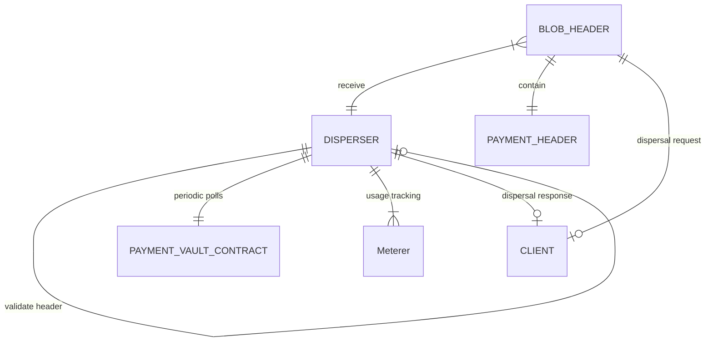
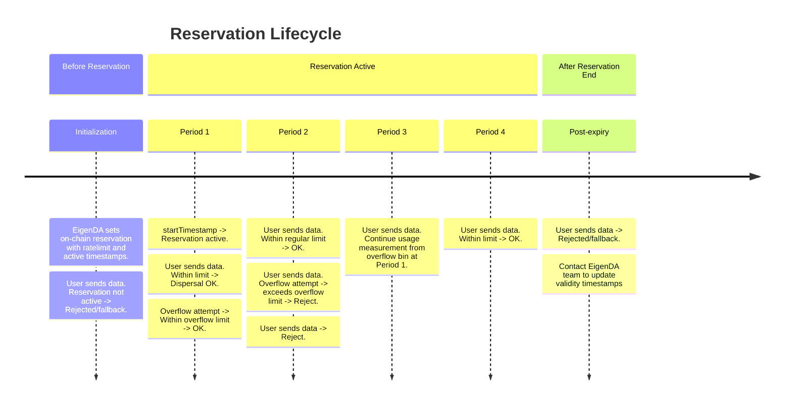
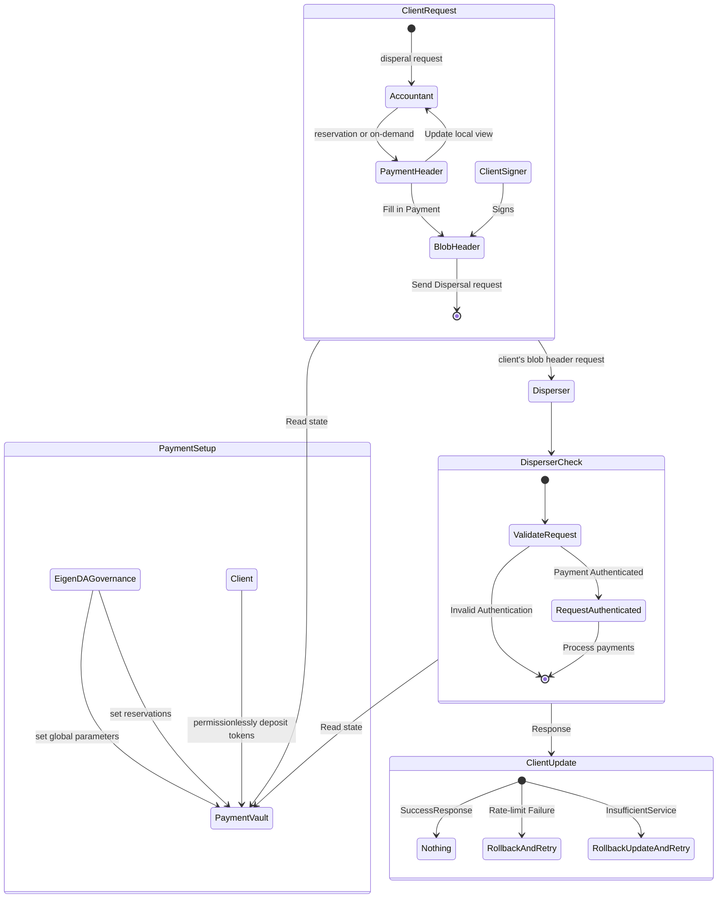

# Payments Release

| Author(s) | |
| :---- | :---- |
| Created | Oct 18, 2024 |
| Status | Draft |
| References |  |
| Discussions | |

# Executive Summary

The Payments update streamlines user interactions with the EigenDA, offering clear, flexible options for managing network bandwidth. With the payments update, EigenDA will support two flexible payment modalities: 

1. **Reserved Bandwidth**: Users can reserve bandwidth for a fixed time period by pre-paying for system capacity, ensuring consistent and reliable throughput at discounted prices. 
2. **Pay per Blob**: Users can make pre-paid payments for occasional usage without time limitations or throughput guarantees. Charges are applied only when the request is successfully processed, providing flexibility for users with dynamic bandwidth requirements.

The payments update supports transparent pricing and metering through a centralized disperser, which handles both accounting and metering. The current design assumes trust in the disperser to allow efficient allocation and distribution of bandwidth.

# Motivation

The overall goal of the payments upgrade is to introduce flexible payment modalities to EigenDA in a manner that can be gracefully extended in order to support permissionless dispersal to the EigenDA validator network. 

## Design Goals

### Reserved Bandwidth

Reserved payments provide customers with consistent bandwidth over a defined period. The EigenDA `PaymentVault` contract maintains a record of existing reservations, with each reservation specifying the bandwidth allowance, period of applicability, etc. 

Once a reservation is created on-chain, it can be updated through the `setReservation` function in the contract. This function is called by EigenDA governance to manage and maintain reservations for users. 

During a reservation's period of applicability, a user client can set a dispersal request authenticated by an account associated with one of these reservations. Such requests are subject to a simple fixed-bin rate limiting algorithm, which helps manage the network load effectively. The fixed-bin algorithm divides time into discrete intervals or 'bins,' and assigns a usage limit to each bin. During each interval, requests are accepted until the bin's capacity is exhausted. This approach ensures that the network is not overloaded during any specific period. 

### Pay Per Blob

Pay per Blob payments allow users to make occasional, pre-paid payments without specific time limitations or throughput guarantees. This approach is ideal for users with unpredictable bandwidth needs. Through the `PaymentVault` contract, users can deposit funds via the `depositOnDemand` function. Charges are only applied once the dispersal request is successfully processed, offering a flexible and efficient solution for dynamic usage patterns.

Users can retrieve their current on-demand balance from the disperser, enabling users to monitor their available funds effectively and plan for future bandwidth usage.

# Features and Specification

## High-level Design

Components
- **Users**: Negotiate reservations with the EigenDA team and/or permissionlesslydeposit tokens for on-demand payments.
- **Disperser Clients**: Users runs a client instance to submit data for dispersal and manages payments.
- **Disperser Server**: The central entity responsible for processing payments and dispersing data.
- **Payment Vault**: Onchain smart contract for managing reservations and on-demand payments.
- **EigenDA Governance**: The EigenDA governance wallet manages the payment vault global parameters and reservations.

Disperser client send a dispersal request containing payment header to the disperser, which will be verified by the disperser's meterer. If the payment is valid, the disperser will disperse the data and update the offchain payment state. The meterer maintains the payment state in the offchain state, and syncs to the payment contract onchain periodically. Currently, the meterer only reads from the on-chain payment contract, and does not make any state changes to the payment contract. Clients can query the disperser for their own offchain state for payment and usage information.

## Low-level Specification

### On-Demand Payments

Data Structures
TODO: Specify data structures
- Payment metadata
- On-chain record

On-chain parameters
TODO: Specify on-chain parameters

A on-demand payment can be created by depositing tokens into the payment vault contract for a particular account, in which the contract stores the total payment deposited to that account (`cumulativePayment`). All on-demand payments shares global parameters including the global symbols per second (`globalSymbolsPerSecond`), global rate interval (`globalRatePeriodInterval`), minimum number of symbols per dispersal (`minNumSymbols`), and the price per symbol (`pricePerSymbol`).

When a disperser client uses the on-demand payment method, the client will calculate the payment amount that is limited by `pricePerSymbol`, `minNumSymbols`, the size of the data to disperse, and the previously sent request. The disperser server take into account of the requests being received out of order and maintain the usages within a global rate limit. If the payment is not enough to cover the request or not valid with respect to previously received requests, or the dispersal is hitting global rate limit, the request will be rejected.

Initially, EigenDA team will set the price per symbol to be 0.4470 gwei, aiming for the price of `0.015ETH/GB`, or `2000gwei/128Kib` dispersal. We limit the global on-demand rate to be 131072 symbols per second and 30 second rate intervals; this allows for ~4 MiB of data to be dispersed every second on average, and the maximum single spike of dispersal to be ~120MiB over 30 seconds.

### Reservation Payments

Data Structures
TODO: Specify data structures
- Payment metadata
- On-chain reservation struct

On-chain parameters
TODO: Specify on-chain parameters

A reservation is defined on-chain, and is used to reserve a specific amount of throughput for a client, represented by a wallet address. The reservation is defined by a limit per period (`symbolsPerSecond`), start time (`startTimestamp`), end time (`endTimestamp`), allowed custom quorum numbers (`quorumNumbers`), and corresponding quorum splits (`quorumSplits`). All reservations shares global parameters including the reservation interval (`reservationPeriodInterval`) and minimum number of symbols per dispersal (`minNumSymbols`).

Symbols per second and the reservation period interval defines the maximum number of symbols that can be dispersed in a single reservation period. A symbol is defined as 32 bytes, and is measured by the length of the erasure coded blob. A disperser client attaches a reservation period index in the payment header to indicate which reservation period the request belongs to. The disperser server accounts for both delay in receival and reservation overflows. If the requests exceeds the allowed delay period or reservation overflows, then the request will be rejected. Once a reservation period is over, the disperser server and client will start considering a new reservation period. If the reservation limit is hit before the period ends, the client will switch to on-demand payments if it is available, or wait for the next reservation period.

As a default, EigenDA team will set reservation period interval to be 5 minutes, and minimum number of symbols per dispersal to be 4096 symbols (This is the size of a 128 KiB blob including metadata). As a user, consider sending requests with respect to these two parameters and your particular reservation's limited symbols per second. If you have a reservation with 100 symbols per second, the disperser will allow for 1 MiB of data to be dispersed every 5 minutes. If you would like to adjust your reservation limit, please contact the EigenDA team.

Below we provide a timeline of the reservation lifecycle.

### Disperser Client requirements

A user may choose to implement their own accountant for the disperser client to use, or use the one implemented by EigenDA, which statelessly tracks the payment states. 

By interacting with the disperser server, the client trusts the disperser server to provide correct on-chain and off-chain payment information upon initialization.

To use the EigenDA's disperser client, as described above, the user will need either negotiate a reservation with the EigenDA team, or permissionlessly deposit tokens into the payment vault contract for the account they want to use. They will supply the corresponding private key to the client, which will be used to sign the blob dispersal requests.

Client can query the disperser for their own offchain payment state, which includes the cumulative payment and the recent period usages. Clients' accountant will priortize using reservations before using on-demand payments.

A client has their specific reservation parameters set on-chain, including timestamp validity, and period limit; all reservations adhere to the same reservation period interval. The disperser will track at least 4 periods per reservation, starting from the previous period to the period after next period. The previous period is used in case of request latency, and the period after next period is used to allow for reasonable overflows. 

If a client used up the available symbols per a reservation period, the client can either wait for the next reservation period, or switch to on-demand payments. Our implementation of disperser client will automatically switch to on-demand payments when the reservation period's usage is depleted. The cumulative payment is incremented by the number of symbols in the blob times the price per symbol. Disperser will check the dispersal requests' cumulative payment against the local payment state, such that the partition of deposted tokens holds with respect to symbols per requests even if the requests arrived out of order. If the cumulative payment exceeds the client's on-chain deposit, cannot fit with the existing payment partitions, or hits the global rate limit, the request will be rejected.

# Security Considerations

TODO: Discuss authentication and rate limiting. 

# Impact Summary

# Action Plan

# References & Relevant Discussions
