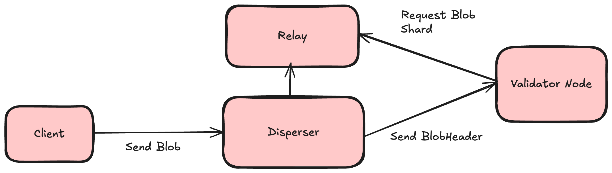

# Executive Summary

EigenDA V2 is a comprehensive network upgrade bringing together variety of architectural updates along with more efficient bridging strategies, in order to make EigenDA more performant, robust, and user-friendly.

EigenDA V2 will have a massive impact on the system’s core performance parameters:

**Reduced confirmation latency**. Rollups that upgrade to the recommended integration strategies will see confirmation latencies reduced from several minutes to less than a minute. The near-term goal for EigenDA V2 is confirmation latencies of less than 10 seconds.

**Improved system throughput and stability**. Optimized network utilization in EigenDA V2 is expected to unlock substantial improvements to the capacity and stability of the decentralized EigenDA network.

Additionally, EigenDA V2 bundles features such as [consumer payments](./payments.md), which allow for permissionless usage of EigenDA by different applications.

## Motivation

EigenDA V2 addresses several performance and usability issues identified in the EigenDA core protocol.

### Design Goals

#### **Control Plane + Data Plane Separation**

The heart of EigenDA V2's architectural update is a cleaner separation of “data plane” and “control plane” communications within the core protocol:

- In the original EigenDA architecture, the disperser sends a payload to the DA nodes consisting of both metadata (blob headers) and data (encoded chunks).
- In the EigenDA V2 upgrade, the disperser simply sends a batch of blob headers to the DA nodes. Upon validating payment and rate limit information, the DA nodes then request to download the associated data payloads from the disperser.

This separation at the protocol level has a few important benefits for enabling improved performance and expanded features:

**Optimized Data Plane Implementations.** EigenDA V2 makes possible optimized and scalable data plane implementations for various component implementations:

- The disperser employs a content distribution network composed of specialized “relays” for serving encoded chunks to DA nodes at high volume and low latency.
- DA Nodes can make use of parallelized requests and other strategies to optimize download performance from the relay CDN. In the future, DA nodes themselves can be optimized to be horizontally scalable for improved performance and robustness.

**DDoS protection for decentralized dispersal.** EigenDA V2 is one of a few final stepping stones toward decentralized dispersal on EigenDA. In the original EigenDA architecture, the push model of coupled data and control plane messages from disperser to DA node presents a DDoS risk for permissionless dispersal; by enabling DA nodes to elect to initiate data plane interactions, EigenDA V2 removes this expensive attack surface, paving the way for a secure decentralized dispersal pattern.

#### Optimized Confirmation Patterns

EigenDA V2 removes EigenDA's batched bridging pattern, although this feature may be reintroduced in an optimized form in future releases. A majority of EigenDA integrations are building toward a near-term state of independence from pessimistic on-chain confirmation.

Eliminating batched bridging enables EigenDA V2 to transmit data to DA nodes in a steady manner, eliminating bursty traffic that sometimes presents difficulties for node systems, while eliminating a major source of latency present in the original system.

Because the EigenDA V2 integration strategy internalizes blob confirmation into the rollup logic, integrations no longer need to wait for Ethereum L1 confirmation or finalization times before referencing a blob within a rollup inbox contract—thus eliminating another major source of latency.

Together, these changes are expected reduce the end-to-end latency of EigenDA from several minutes to several seconds.

#### Other Optimizations

EigenDA V2 includes a refined model for data allocation to DA nodes and blob security verification. This model results primarily in simplified logic and reduced encoding burden for the EigenDA disperser.

## Features & Specification

### High-Level Design

EigenDA V2 involves updates to the following system components as well as their respective clients:

- Dispersers
- Validator Nodes



In EigenDA V2, the disperser runs a new component known as a Relay, which acts as a server for encoded blob chunks, KZG opening proofs, and unencoded blobs.

### Blob lifecycle

- Client disperses a blob via disperser’s `DisperseBlob` gRPC endpoint.
- Disperser stores the blob in local storage, encodes the blob, and stores the encoded chunks in the relay. The blob is in `ENCODED` status.
- Disperser constructs a batch by collecting the blob headers of encoded blobs and makes `StoreChunks` requests to validator nodes by sending the batch consisting of the blob headers.
- Validator node receives the `StoreChunks` request, downloads the chunks from the relay, validates them, stores them, and signs the batch.
- Disperser receives the signatures from validator nodes, validates & aggregates them, and produces attestation for the batch. The blob is in `CERTIFIED` status.
- Client checks the dispersal status via disperser’s `GetBlobStatus` gRPC endpoint.

### Low-Level Specification

For the full documentation of the EigenDA protobuf schema, see [this documentation](https://github.com/Layr-Labs/eigenda/blob/master/api/docs/eigenda-protos.md). The `.proto` source files can be found [here](https://github.com/Layr-Labs/eigenda/tree/master/api/proto).

#### Offchain Data Structures

Below are some of the fundamental data structures used in many of the EigenDA APIs.

```protobuf
message BlobHeader {
  // Blob version
  uint32 version = 1;
  repeated uint32 quorum_numbers = 2;
  common.BlobCommitment commitment = 3;
  common.PaymentHeader payment_header = 4;

  // signature over keccak hash of the blob_header that can be verified by blob_header.account_id
  bytes signature = 5;
}

// BlobCertificate is what gets attested by the network
message BlobCertificate {
  BlobHeader blob_header = 1;
  repeated uint32 relays = 2;
}

// BatchHeader is the header of a batch of blobs
message BatchHeader {
  // batch_root is the root of the merkle tree of the hashes of blob certificates in the batch
  bytes batch_root = 1;
  // reference_block_number is the block number that the state of the batch is based on for attestation
  uint64 reference_block_number = 2;
}

// Batch is a batch of blob certificates
message Batch {
  // header contains metadata about the batch
  BatchHeader header = 1;
  // blob_certificates is the list of blob certificates in the batch
  repeated BlobCertificate blob_certificates = 2;
}
```

#### DA Node Interfaces

Blobs are broken up into KZG encoded chunks and distributed to DA nodes. The following API can be used to download those chunks.

In the “happy pathway”, it’s generally going to be faster and easier to download the unencoded blob directly from a relay. Where downloading chunks from a DA node becomes important is from a security perspective. If all relays in possession of a blob go down or are maliciously/selfishly withholding the data, the DA nodes are a very reliable way to fetch the data (as only a fraction of the chunks distributed to DA nodes are needed to reconstruct the original data).

More detailed documentation on this API can be found [here](https://github.com/Layr-Labs/eigenda/blob/master/api/docs/node_v2.md).

```protobuf
service Retrieval {
  // GetChunks retrieves the chunks for a blob custodied at the Node.
  rpc GetChunks(GetChunksRequest) returns (GetChunksReply) {}
  // Retrieve node info metadata
  rpc NodeInfo(NodeInfoRequest) returns (NodeInfoReply) {}
}
```

#### Relay Interfaces

Relays are responsible for storing and serving both unencoded blobs as well as encoded chunks. Encoded chunks can only be downloaded by authenticated DA validator nodes.

More detailed documentation on this API can be found [here](https://github.com/Layr-Labs/eigenda/blob/master/api/docs/relay.md).

```protobuf
// Relay is a service that provides access to public relay functionality.
service Relay {
  // GetBlob retrieves a blob stored by the relay.
  rpc GetBlob(GetBlobRequest) returns (GetBlobReply) {}
  // GetChunks retrieves chunks from blobs stored by the relay.
  rpc GetChunks(GetChunksRequest) returns (GetChunksReply) {}
}
```

#### Disperser Interfaces

The disperser API can be used to send blobs to the Eigen DA protocol. More detailed documentation on this API can be found [here](https://github.com/Layr-Labs/eigenda/blob/master/api/docs/disperser_v2.md).

```protobuf
// Disperser defines the public APIs for dispersing blobs.
service Disperser {
  // DisperseBlob accepts blob to disperse from clients.
  // This executes the dispersal asynchronously, i.e. it returns once the request
  // is accepted. The client could use GetBlobStatus() API to poll the the
  // processing status of the blob.
  rpc DisperseBlob(DisperseBlobRequest) returns (DisperseBlobReply) {}

  // GetBlobStatus is meant to be polled for the blob status.
  rpc GetBlobStatus(BlobStatusRequest) returns (BlobStatusReply) {}

  // GetBlobCommitment is a utility method that calculates commitment for a blob payload.
  rpc GetBlobCommitment(BlobCommitmentRequest) returns (BlobCommitmentReply) {}

  // GetPaymentState is a utility method to get the payment state of a given account.
  rpc GetPaymentState(GetPaymentStateRequest) returns (GetPaymentStateReply) {}
}
```

### Onchain Interfaces

An overview of where data is stored and what interfaces are available on the EigenDA contracts

#### Blob Verification

On-chain verification of a blob can be performed by calling the EigenDABlobVerifier contract or by using the internal EigenDABlobVerificationUtils library. As noted previously, these view functions typically will not be called pessimistically within rollup integrations but called within the rollup’s own fault proof or validity proof.

```solidity
// A batch header and corresponding signature attestation over that batch
struct SignedBatch {
    BatchHeaderV2 batchHeader;
    Attestation attestation;
}

// A header for a batch of blobs
struct BatchHeaderV2 {
    bytes32 batchRoot; // the merkle root of the blob certificates in the batch
    uint32 referenceBlockNumber; // the block number that the state of the batch is based on for attestation
}

// A proof for verifying that a blob belongs to a batch
struct BlobVerificationProofV2 {
    BlobCertificate blobCertificate;
    uint32 blobIndex; // the index of the blob in the merkle tree
    bytes inclusionProof; // the merkle proof for the blobs index
}

// A certifcate for a blob attested as availble by the network
struct BlobCertificate {
    BlobHeaderV2 blobHeader;
    uint32[] relayKeys;
}

// A header for blob information
struct BlobHeaderV2 {
    uint16 version; // the blob version
    bytes quorumNumbers; // all quroums that the blob is submitted to
    BlobCommitment commitment;
    bytes32 paymentHeaderHash;
}

// A KZG commitment for a blob
struct BlobCommitment {
    BN254.G1Point commitment;
    BN254.G2Point lengthCommitment;
    BN254.G2Point lengthProof;
    uint32 dataLength;
}

// An attestation by operators that contains BLS signature information
struct Attestation {
    BN254.G1Point[] nonSignerPubkeys;
    BN254.G1Point[] quorumApks;
    BN254.G1Point sigma;
    BN254.G2Point apkG2;
    uint32[] quorumNumbers;
}

// A complete set of information used for BLS signature verification that can be retrieved given an attestation
struct NonSignerStakesAndSignature {
    uint32[] nonSignerQuorumBitmapIndices;
    BN254.G1Point[] nonSignerPubkeys;
    BN254.G1Point[] quorumApks;
    BN254.G2Point apkG2;
    BN254.G1Point sigma;
    uint32[] quorumApkIndices;
    uint32[] totalStakeIndices;
    uint32[][] nonSignerStakeIndices;
}

interface IEigenDABlobVerifier {

	// returns if the given BatchHeader, BlobVerificationProof, and NonSignerStakesAndSignature are valid
	function verifyBlobV2(
		BatchHeaderV2 calldata batchHeader,
		BlobVerificationProofV2 calldata blobVerificationProof,
		NonSignerStakesAndSignature calldata nonSignerStakesAndSignature
	) external view;

	// returns if the given SignedBatch and BlobVerificationProof are valid
	function verifyBlobV2FromSignedBatch(
		SignedBatch calldata signedBatch,
		BlobVerificationProofV2 calldata blobVerificationProof
	) external view;

	// returns a complete NonSignerStakesAndSignature struct needed for BLS
	// signature verification given an Attestation from a SignedBatch
	function getNonSignerStakesAndSignature(
		SignedBatch calldata signedBatch
	) external view returns (NonSignerStakesAndSignature memory);

}
```

#### Blob Versions and Security Thresholds

Information about blob versions and security thresholds are stored onchain in the EigenDAThresholdRegistry and can be retrieved from either the EigenDAThresholdRegistry or EigenDABlobVerifier contracts

```solidity
// parameters that are stored for a blob version
struct VersionedBlobParams {
    uint32 maxNumOperators;
    uint32 numChunks;
    uint8 codingRate;
}

// a set of securty thresholds that must be met with a blob version
struct SecurityThresholds {
    uint8 confirmationThreshold;
    uint8 adversaryThreshold;
}

interface IEigenDAThresholdRegistry {

	// returns the default security thresholds used when thresholds are not otherwise specified
	function getDefaultSecurityThresholdsV2()
		external view returns (SecurityThresholds memory);

	// returns the parameters for a given blob version
	function getBlobParams(uint16 version)
		external view returns (VersionedBlobParams memory);

}

interface IEigenDABlobVerifier is IEigenDAThresholdRegistry {

	// verifies a set of given security thresholds against given blob version parameters
	function verifyBlobSecurityParams(
		VersionedBlobParams memory blobParams,
	  SecurityThresholds memory securityThresholds
  ) external view;

	// verifies a set of given security thresholds against the parameters of a given blob version
  function verifyBlobSecurityParams(
	  uint16 version,
	  SecurityThresholds memory securityThresholds
  ) external view;

}
```

#### Disperser

Disperser information is stored onchain and can be retrieved from the EigenDADisperserRegistry contract

```solidity
// The disperser information stored onchain for a disperser key
struct DisperserInfo {
    address disperserAddress;
}

interface IEigenDADisperserRegistry {

	// returns the address for a given disperser key
  function disperserKeyToAddress(uint32 key) external view returns (address);
}
```

#### Relay

ReIay information is stored onchain and can be retrieved from the EigenDARelayRegistry contract

```solidity
// The relay information stored onchain for a relay key
struct RelayInfo {
    address relayAddress;
    string relayURL;
}

interface IEigenDARelayRegistry {

	// returns the address for a given relay key
	function relayKeyToAddress(uint32 key) external view returns (address);

	// returns the URL for a given relay key
	function relayKeyToUrl(uint32 key) external view returns (string memory);

}
```

## Security Considerations

### Throttles

The V2 upgrade introduces enhanced throttling mechanisms to better manage finite resources like bandwidth, memory, and computational capacity. These updates improve system resilience against traffic surges, whether from malicious activity or organic demand spikes. Throttles are calibrated to avoid impacting typical usage while ensuring critical subsystems remain stable under stress.

### Authenticated Traffic

Authenticated traffic now benefits from resource-aware throttling, which allocates resources more effectively by leveraging cryptographic identity verification. Key protocol components, including the disperser, relays, and DA nodes, now utilize authenticated channels to enhance robustness during high-load scenarios. V2’s updates significantly strengthen these interactions, bolstering the data backbone’s reliability.

### Enhanced Security for RPCs

V2 addresses potential denial-of-service risks by introducing authentication for RPCs exposed by DA nodes. This ensures that only callers with valid cryptographic keys can access these RPCs, reducing reliance on external firewalls for security. These changes enhance the platform's security posture and protect against misconfigurations, ensuring more reliable operations.

## Impact Summary

### Validator Operator Impact

Operator will need to update their DA validator node software in order to attest blobs dispersed as part of the V2 system. The V2 validator node software is implemented in the same binary as V1, so that operators only need to update their node software version.

V2 bandwidth usage will stay within the parameters of advertised V1 usage, so that existing system requirements specifications remain valid.

### Rollup Stack Impact

Rollups will need to perform the following upgrade actions:

1. **Update data routing**. Deploying a version of https://github.com/Layr-Labs/eigenda-proxy that supports V2 (internally this new release will use the [EigenDa clients V2](https://github.com/Layr-Labs/eigenda/tree/master/api/clients/v2)) will enable use of the V2 endpoints. We will make an announcement once such a release is ready.
   1. Once you do so, all blob POST request submitted to proxy will be dispersed to the EigenDA V2 disperser, and encoded using a commitment with a [0x1 version byte](https://github.com/Layr-Labs/eigenda-proxy?tab=readme-ov-file#commitment-schemas) (as opposed to 0x0 for V1).
   2. GET requests will be [routed](https://github.com/Layr-Labs/eigenda-proxy/blob/44191c1a1b3149d52a80f2fa82690f4a92ac62db/server/routing.go#L22) to the correct V1 or V2 network based on their commitment version byte.
2. **Implement Secure Verification**. We are in the process of individually updating each rollup stack in order to support secure integration strategies (such as fault proofs or validity proofs) for V2.

## Action Plan

The V2 protocol will be progressively released to the Holesky testnet and Ethereum mainnet environments according to the following expected timeline. Once V2 validator software has been released on an environment, validator operators will have a period of some number of weeks in order to upgrade their software

| **Environment** | **Targeted release date** | **Eligibility for ejection** |
| --------------- | ------------------------- | ---------------------------- |
| Testnet         | Feb 20                    | + 2 weeks                    |
| Mainnet         | Mar 20                    | + 4 weeks                    |
